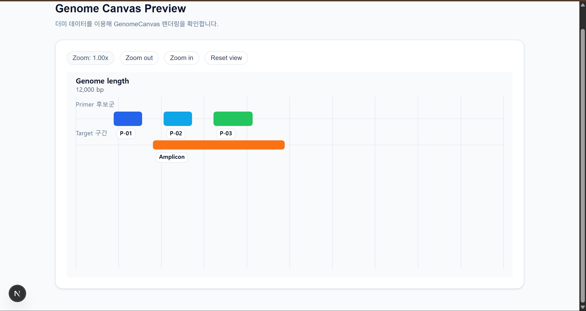

# 🧬 PrimeFlow: Frontend Visualization Engine


> **High-Performance PCR Primer Design & Visualization Platform**
>
> 대용량 유전자 서열(10,000bp+)을 웹 브라우저에서 지연 없이 분석하고 시각화하는 프론트엔드 엔진 리포지토리입니다.

## 📖 프로젝트 개요

**PrimeFlow**는 생명과학 연구원들이 PCR 프라이머를 설계할 때 겪는 비효율을 해결하기 위한 웹 솔루션입니다.
본 리포지토리(Frontend)는 백엔드에서 분석된 유전자 데이터와 프라이머 후보군을 **HTML5 Canvas**를 활용해 시각적으로 표현하는 데 집중합니다.

### 💡 핵심 기술 (Key Features)

* **Custom Rendering Engine:** DOM 조작 방식이 아닌, Canvas API 기반의 자체 렌더링 엔진을 구현하여 10,000bp 이상의 데이터를 60fps로 부드럽게 렌더링합니다.
* **Optimization Algorithms:**
    * **View Culling:** 이분 탐색(Binary Search)을 활용하여 화면 밖의 데이터 렌더링을 생략합니다.
    * **Auto Layout:** 그리디(Greedy) 알고리즘을 응용하여 겹치는 프라이머 구간을 자동으로 배치합니다.
* **Interactive UX:** 행렬 변환(Matrix Transformation)을 적용한 정밀한 Zoom-In/Out 및 Panning 기능을 제공합니다.

## 🛠 기술 스택 (Tech Stack)

* **Core:** Next.js 16 (App Router), TypeScript
* **Graphics:** HTML5 Canvas API (2D Context)
* **Styling:** Tailwind CSS
* **State Management:** Zustand
* **Data Fetching:** SWR / TanStack Query
* **Deployment:** Vercel

## 🏗️ 프로젝트 구조 (Project Architecture)

```text
PrimerFlow-FE/
├── app/                  # 🌐 [Main] 페이지 및 라우팅 (Next.js App Router)
│   ├── page.tsx          # 메인 대시보드 화면
│   └── layout.tsx        # 전역 레이아웃 (Header, Font 등)
│
├── components/           # 🧩 UI 컴포넌트 모음
│   ├── canvas/           # ✨ [Core] 시각화 엔진 (GenomeCanvas, Controls 등)
│   └── ui/               # 공통 UI (Button, Input, Card 등)
│
├── lib/                  # 🧮 순수 함수 및 알고리즘
│   ├── algorithms/       # [Optimization] 이분 탐색, 레이아웃 알고리즘
│   ├── math/             # [Math] 좌표 변환(World <-> Screen), 행렬 연산
│   └── parsers/          # [Data] FASTA 파싱 및 API 데이터 변환
│
├── store/                # 💾 전역 상태 관리 (Zustand)
│   └── useViewStore.ts   # 줌 레벨, 뷰포트 위치 등 관리
│
├── docs/                 # 📄 문서 및 프롬프트 아카이브
│   └── prompts/          # AI 개발을 위한 기능 명세서(Spec) 모음
│
└── public/               # 🖼️ 정적 파일 (이미지, 아이콘)
```

## 🚀 시작하기 (Getting Started)

### 사전 요구사항
* Node.js 20.9.0 이상
* npm 또는 yarn

### 설치 및 실행

```bash
# 1. 저장소 클론
git clone [https://github.com/Seq-Lab/PrimerFlow-FE.git](https://github.com/Seq-Lab/PrimerFlow-FE.git)

# 2. 프로젝트 폴더로 이동
cd PrimerFlow-FE

# 3. 패키지 설치
npm install

# 4. 환경 변수 설정 (.env.local 생성)
# (백엔드 API 주소 설정 예시)
# echo "NEXT_PUBLIC_API_URL=http://localhost:8000" > .env.local

# 5. 개발 서버 실행
npm run dev
```


## 주간 진행 상황
### Week 1 (25.12.22 - 25.12.28)
- 작업 내역: 
  - 기술스택 선정
    - Next.js: 메인 페이지(app/page.tsx)와 전역 레이아웃을 구성, 정적 리소스 관리·헤드 설정
    - Typescript: 컴포넌트·전역 스토어·유틸 타입을 명시
    - Canvas API: 캔버스 컨텍스트를 직접 처리; 대용량 서열 랜더링, 줌/패닝 변환, 텍스트/바 도형 그리기 
    - Zustand: 캔버스 뷰 상태, 리셋/업데이트 액션의 전역 관리
    - Vercel: Next.js앱 배포
  - 프로젝트 기본 아키텍처 및 스켈레톤 코드 구성
- AI 활용: Gemini로 자세한 내용 프롬프트로 작성, codex로 프로젝트 아키텍처 및 스켈레톤 코드 작성.
- 다음 주 계획: page.tsx, layout.tsx 구현, 목 데이터 출력 해보기

### Week 2 (25.12.29 - 26.01.04)z`
- 작업 내역: 
  - 더미 데이터로 페이지에 연결
  - 뷰 상태(Zustand)와 줌·패닝 동작을 정돈
- AI 활용:
  - codex 활용하여 layout.tsx, page.tsx 세부 구현 및 디버깅
- 완료 기능:
  - 목 데이터의 출력 상태 확인
- 테스트 결과:
  - 
- 다음 주 계획: 스펙 기반 초기 입력 폼과 검증 로직 착수.

### Week 3 (26.01.05 ~ 26.01.11)
- 작업 내역:
  - PCR 프라이머 디자인 스펙을 작성해 1-based 규칙·IUPAC 제한·성능 목표를 포함한 요구사항과 시나리오를 정리
  - 메인 UI 디자인 결정; 다크 톤 4단계 스텝 플로우로 리워크
  - Genome 타입 분리
- AI 활용: 
  - stitch, figma에 같은 프롬프트를 넣고 디자인을 비교, 채택. 
- 완료 기능:
  - 단계별 UI 구현 완료
    - 1단계: 시퀀스 입력(FASTA/raw textarea)
    - 2단계: Primer Properties: GC% 범위, 최대 Tm 차이, GC Clamp 온/오프, Poly-X 제한, 농도/염 조건 입력
    - 3단계: Binding Location: Search range 시작/끝, Exon junction 고려 여부, Intron 포함 여부와 Intron size 범위, Restriction enzyme 목록/선택.
    - 4단계: 결과물 출력
- 테스트 결과:
  - 1단계

    
  - 2단계

    
  - 3단계

    
  - 4단계

    
- 다음 주 계획: 실제 데이터 연동, GenomeCanvas 미리보기·컨트롤 마무리.

### Week 4 (26.01.12 ~ 26.01.18)
- 작업 내역:
  - 백엔드 모킹 서비스 구현 및 결과 시각화
  - Step 1 시퀀스 입력 편의성 개선
  - 컴포넌트 아키텍처 개선 및 UI 업데이트
- AI 활용:
  - codex로 캔버스가 표시되는 모달 구현
  - paste등 버튼 기능 구현
- 완료 기능:
  - 목데이터를 모달을 이용하여 표시
  - Step1에서 DNA서열 입력 시, fasta파일 업로드, 클립보드에서 붙여넣기 지원

- 테스트 결과:
  - 목데이터 표시 확인

    
- 다음 주 계획: 완성된 백엔드와 연동하여 결과 표시 및 디버깅

### Week 5 (26.01.19 ~ 26.01.25)
- 작업 내역: 프론트엔드-백엔드 간 API 통신 규격(Spec) 정의 및 연동 구현
- AI 활용: codex 이용하여 복잡한 Nested Object을 UI 전용 상태(Flat Object)로 변환하는 어댑터 패턴 코드 자동 생성
- 완료 기능: 
  - 프라이머 설계 요청(Request) 프로세스 구현: 입력값 → 어댑터 → API 호출 흐름 완성
  - 결과 모달(Result Modal) 데이터 바인딩: Mock 데이터를 활용하여 캔버스 및 리스트에 분석 결과 렌더링
- 다음 주 계획: 사용자 입력 데이터(DNA 서열)에 대한 전처리(Sanitization) 및 유효성 검증 로직 구현


### Week 6 (26.01.26 ~ 26.02.01)
- 작업 내역: 사용자 입력 데이터 전처리 및 유효성 검증
- AI 활용: DNA 서열 입력을 위한 정규식(Regex) 기반 유효성 검사 및 IUPAC 모호성 코드 처리 로직 생성
- 완료 기능:
- 다음 주 계획:
