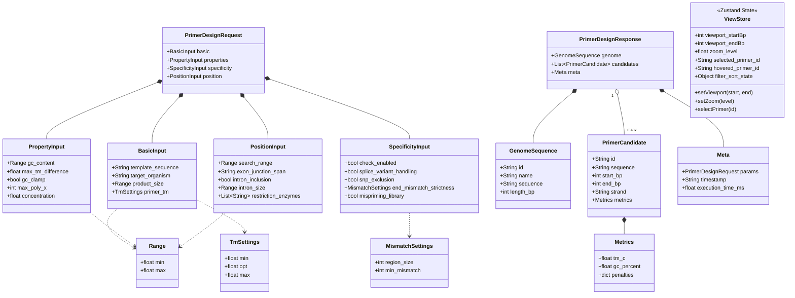
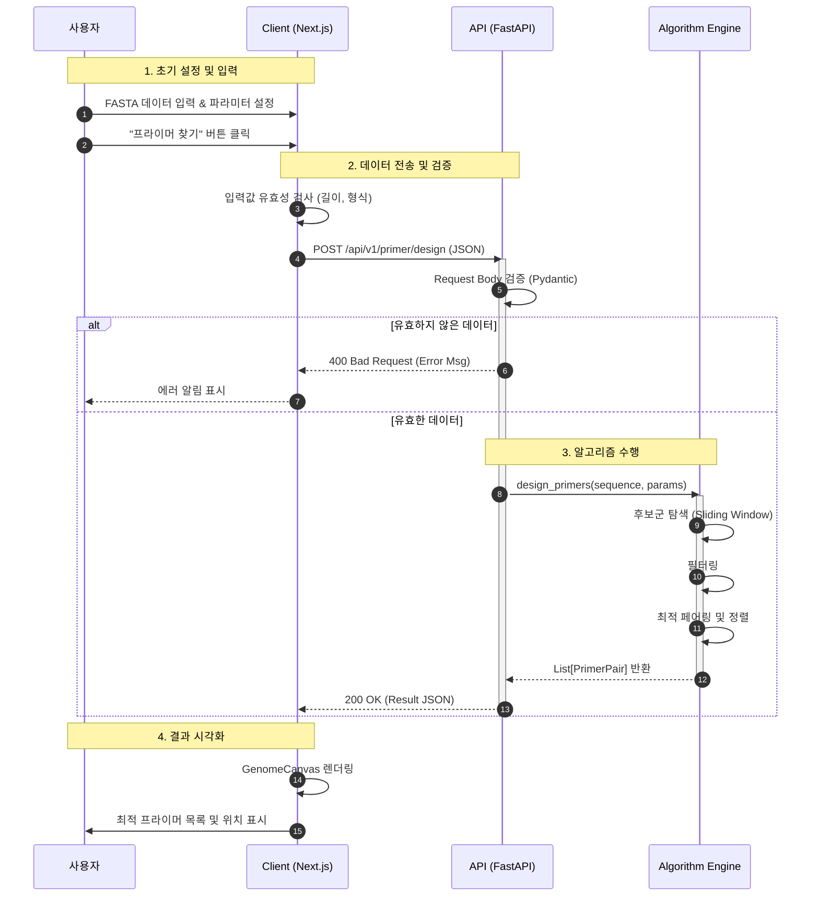
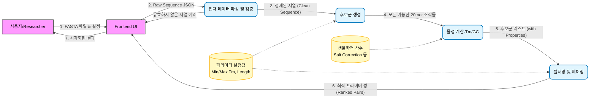
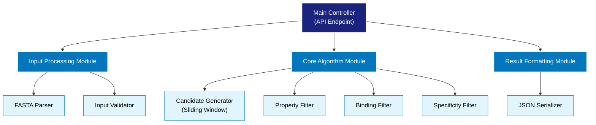

# PrimerFlow 시스템 설계 및 아키텍처
이 문서는 PrimerFlow의 핵심 데이터 구조(Class Diagram)와 시스템 동작 흐름(Sequence Diagram)을 정의합니다. 
테스트 케이스 작성 및 기능 구현 시 본 문서를 기준으로 로직을 검증합니다.

## 1. Class Diagram
Backend의 주요 데이터 모델과 알고리즘 처리 클래스 구조입니다.

## 2. Sequence Diagram
Backend의 주요 시스템 동작 흐름 구조입니다.

# Data Flow Diagram and Structure Chart

이 문서는 사용자의 유전체 데이터(FASTA)가 시스템 내부에서 어떤 변환 과정을 거쳐 최종 프라이머 쌍(Primer Pair)으로 도출되는지를 시각화한 DFD Level 1입니다.

## DFD Level 1: Primer Design Process

# PrimerFlow 구조 도표 (Structure Chart)

이 문서는 DFD에서 정의된 데이터 처리 과정을 수행하기 위한 소프트웨어 모듈의 계층 구조를 정의합니다.
상위 모듈이 하위 모듈을 제어하며, 화살표는 호출 관계를 나타냅니다.

## Structure Chart

